# DEHN Interactive Manual AI Platform - Technical Architecture

## 🏗️ System Overview

The DEHN Interactive Manual AI Platform is a sophisticated multimodal RAG (Retrieval-Augmented Generation) system that provides product-specific AI assistance for electrical installation manuals. The system ensures zero hallucination by maintaining isolated embeddings for each product and using only verified manual content.

## 🔄 User Workflow Diagram

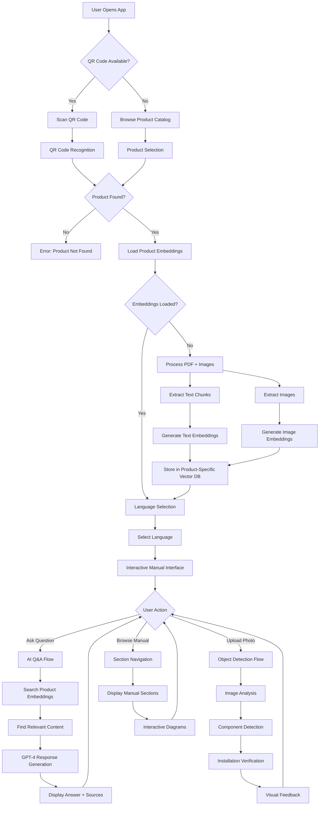

## 🎯 Frontend Architecture

### **Technology Stack**
- **Framework**: Next.js 14 with App Router
- **Language**: TypeScript for type safety
- **Styling**: Tailwind CSS with custom DEHN branding
- **State Management**: React hooks (useState, useEffect)
- **Camera Integration**: HTML5 QR Code Scanner
- **Audio**: Web Speech API for voice features

### **Component Architecture**

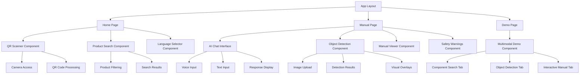

### **State Management Flow**

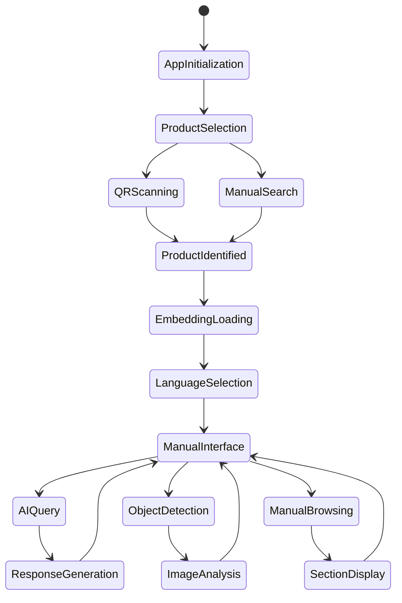

## ⚙️ Backend Architecture

### **Technology Stack**
- **Runtime**: Node.js with Next.js API Routes
- **AI Services**: OpenAI GPT-4 + GPT-4 Vision + Embeddings
- **PDF Processing**: PDF.js for text and image extraction
- **Vector Storage**: In-memory FAISS-like similarity search
- **Image Processing**: Canvas API for PDF image extraction
- **Type Safety**: TypeScript throughout

### **Service Layer Architecture**

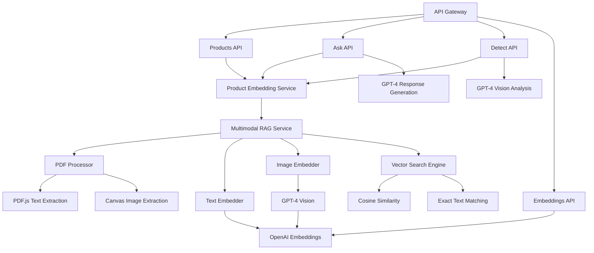

### **Data Flow Architecture**

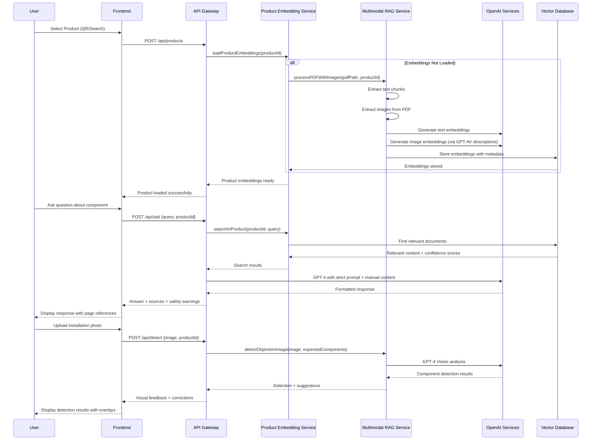

## 🗄️ Data Architecture

### **Product Embedding Structure**

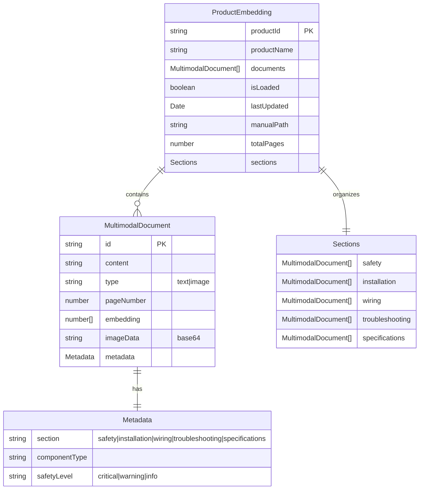

### **Vector Search Implementation**

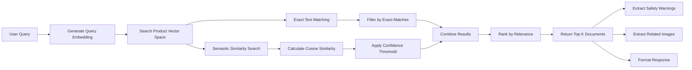

## 🔒 Security & Compliance Architecture

### **Data Protection Flow**

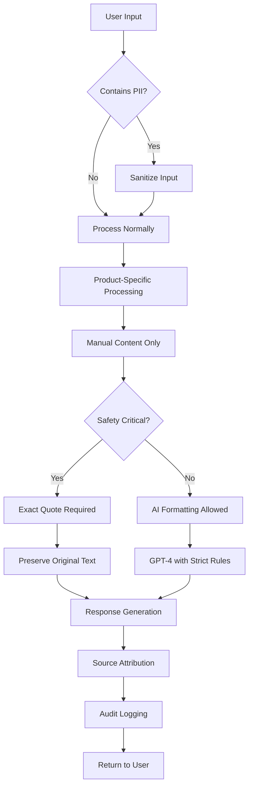

### **AI Safety Measures**

```mermaid
flowchart TD
    A[AI Request] --> B[Input Validation]
    B --> C[Product Context Isolation]
    C --> D[Manual Content Verification]

    D --> E{Content Available?}
    E -->|No| F[Return "Not Found" Message]
    E -->|Yes| G[Apply Safety Rules]

    G --> H[Temperature: 0.1 for Accuracy]
    G --> I[Max Tokens: 500 for Conciseness]
    G --> J[System Prompt: Strict Rules]

    H --> K[GPT-4 Processing]
    I --> K
    J --> K

    K --> L[Response Validation]
    L --> M{Contains Hallucination?}
    M -->|Yes| N[Reject Response]
    M -->|No| O[Add Source References]

    N --> P[Fallback to Exact Content]
    O --> Q[Return Verified Response]
    P --> Q
```

## 📊 Performance Architecture

### **Embedding Loading Strategy**

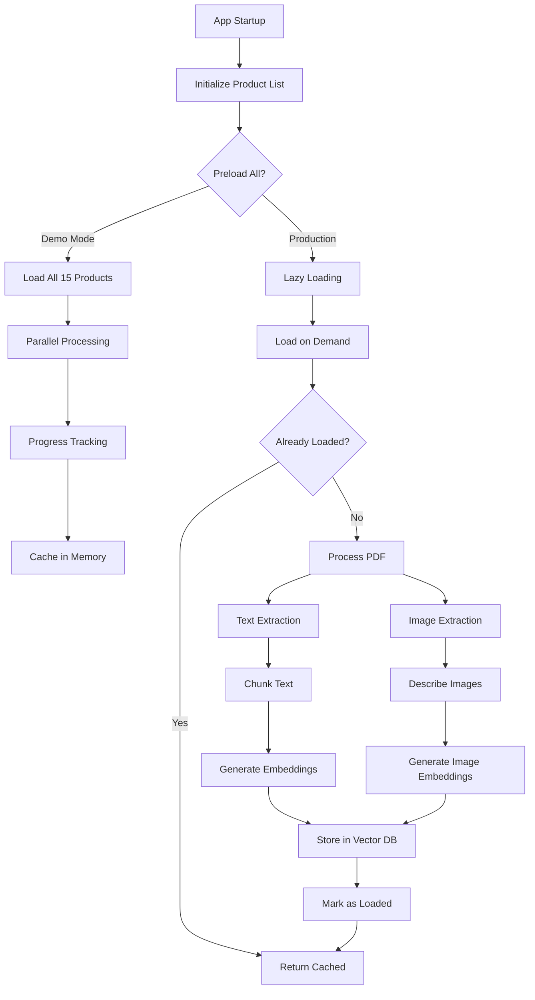

### **Response Time Optimization**

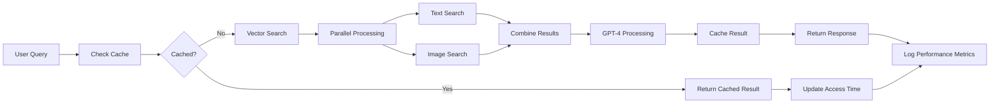

## 🔧 API Specifications

### **Core Endpoints**

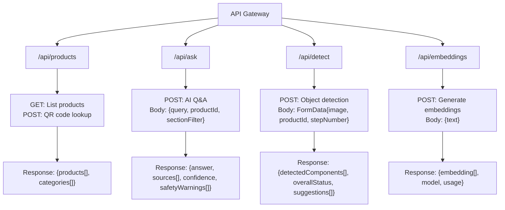

### **Error Handling Flow**

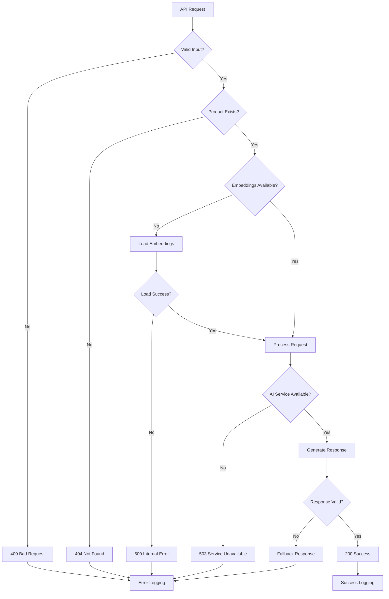

## 🚀 Deployment Architecture

### **Production Deployment Flow**

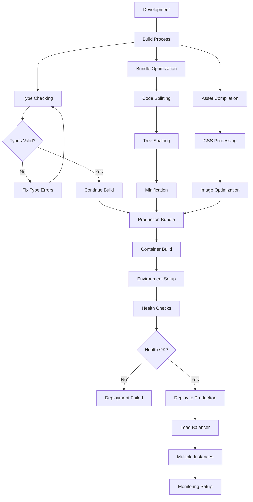

### **Scaling Strategy**

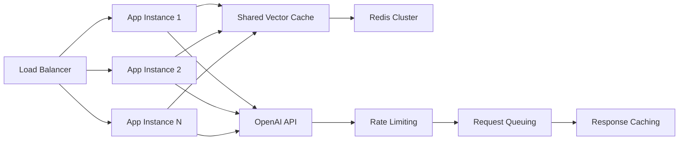

## 🔄 Feedback System for Continuous Model Training

### **Data Science Approach to Model Improvement**

The DEHN Interactive Manual AI Platform implements a sophisticated feedback loop system that transforms user interactions into valuable training data for continuous model improvement. This system addresses the current limitation of relying on mock data by creating a robust pipeline for collecting, validating, and utilizing real-world installation photos.

### **Feedback Collection Architecture**

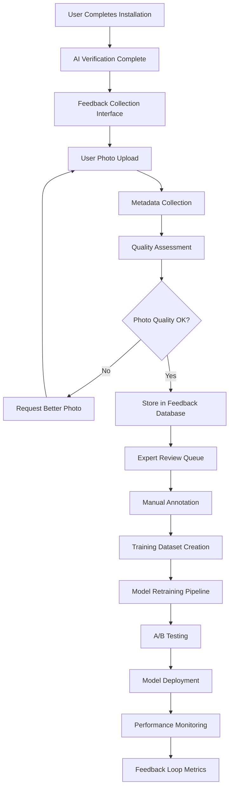

### **Multimodal Data Collection Strategy**

Based on the CLIP-based multimodal RAG approach, the feedback system collects:

1. **Installation Photos**: High-resolution images of completed installations
2. **Component Annotations**: Bounding boxes and labels for detected components
3. **Installation Context**: Product ID, step number, environmental conditions
4. **User Feedback**: Correctness ratings, issue reports, suggestions
5. **Expert Validation**: Professional electrician reviews and corrections

### **CLIP-Enhanced Feedback Processing**

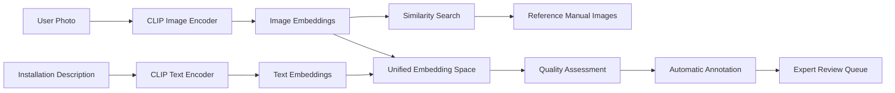

### **Feedback Data Schema**

```typescript
interface FeedbackEntry {
  id: string;
  timestamp: Date;
  userId: string;
  productId: string;
  stepNumber: number;

  // Image data
  originalImage: {
    base64Data: string;
    metadata: ImageMetadata;
    clipEmbedding: number[];
  };

  // AI Analysis
  aiAnalysis: {
    detectedComponents: ComponentDetection[];
    overallStatus: 'complete' | 'incomplete' | 'error';
    confidence: number;
    suggestions: string[];
  };

  // User feedback
  userFeedback: {
    correctnessRating: number; // 1-5 scale
    reportedIssues: string[];
    additionalComments: string;
    wouldRecommend: boolean;
  };

  // Expert validation
  expertReview?: {
    reviewerId: string;
    reviewDate: Date;
    actualComponents: ComponentAnnotation[];
    correctnessScore: number;
    trainingValue: 'high' | 'medium' | 'low';
    notes: string;
  };

  // Training metadata
  trainingMetadata: {
    isValidForTraining: boolean;
    qualityScore: number;
    annotationComplete: boolean;
    usedInTraining: boolean;
    modelVersion: string;
  };
}
```

### **Continuous Learning Pipeline**

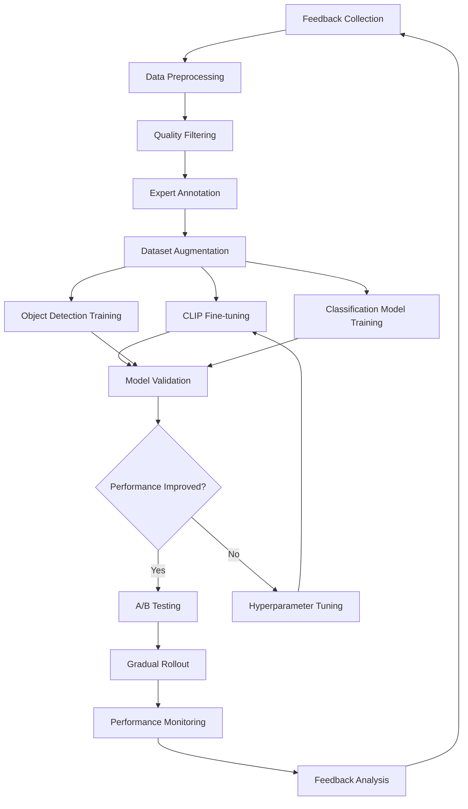

### **Implementation Components**

#### **1. Feedback Collection API**

```typescript
// POST /api/feedback/submit
interface FeedbackSubmissionRequest {
  productId: string;
  stepNumber: number;
  installationImage: File;
  userRating: number;
  comments?: string;
  reportedIssues?: string[];
}

// GET /api/feedback/stats
interface FeedbackStats {
  totalSubmissions: number;
  averageRating: number;
  commonIssues: string[];
  improvementTrends: TrendData[];
}
```

#### **2. Expert Review Interface**

```typescript
interface ExpertReviewInterface {
  pendingReviews: FeedbackEntry[];
  annotationTools: {
    boundingBoxTool: BoundingBoxAnnotator;
    componentLabeler: ComponentLabeler;
    qualityAssessment: QualityScorer;
  };
  batchProcessing: BatchReviewTools;
  qualityMetrics: ReviewQualityMetrics;
}
```

#### **3. Training Data Management**

```typescript
interface TrainingDataManager {
  datasetVersioning: DatasetVersion[];
  qualityFiltering: QualityFilter;
  augmentationPipeline: DataAugmentation;
  exportFormats: {
    coco: COCOExporter;
    yolo: YOLOExporter;
    clip: CLIPDatasetExporter;
  };
}
```

### **Model Training Architecture**

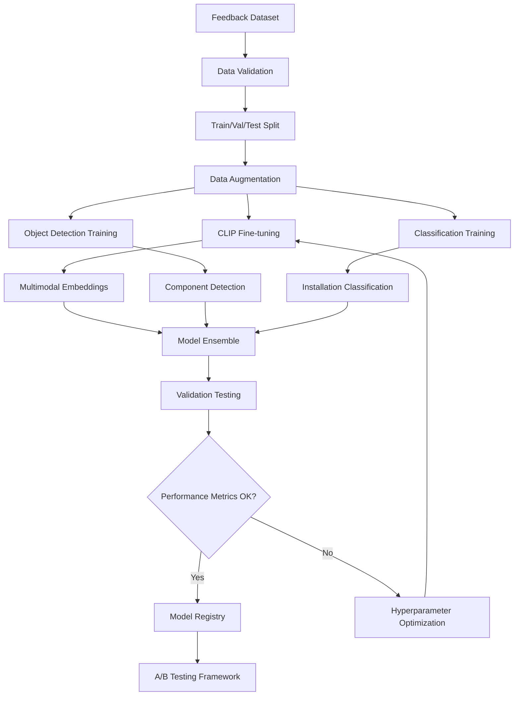

### **Quality Assurance Metrics**

```typescript
interface QualityMetrics {
  // Data quality
  imageQuality: {
    resolution: number;
    brightness: number;
    sharpness: number;
    relevance: number;
  };

  // Annotation quality
  annotationAccuracy: number;
  interAnnotatorAgreement: number;
  completeness: number;

  // Model performance
  detectionAccuracy: number;
  falsePositiveRate: number;
  falseNegativeRate: number;
  userSatisfactionScore: number;

  // Business metrics
  installationSuccessRate: number;
  userRetentionRate: number;
  supportTicketReduction: number;
}
```

### **Privacy and Compliance**

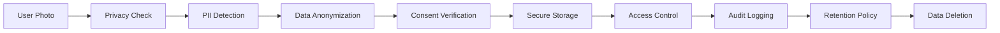

### **Deployment Strategy**

1. **Phase 1**: Feedback collection interface with basic quality filtering
2. **Phase 2**: Expert review system and manual annotation tools
3. **Phase 3**: Automated training pipeline with CLIP fine-tuning
4. **Phase 4**: A/B testing framework and gradual model deployment
5. **Phase 5**: Full continuous learning system with real-time updates

### **Success Metrics**

- **Data Collection**: 1000+ high-quality annotated images per month
- **Model Performance**: 15% improvement in detection accuracy quarterly
- **User Satisfaction**: 90%+ positive feedback on AI suggestions
- **Business Impact**: 25% reduction in installation support tickets

This comprehensive feedback system transforms the DEHN Interactive Manual AI Platform from a static system into a continuously improving, self-learning platform that gets better with every user interaction while maintaining the highest standards of privacy and data quality.

This technical architecture ensures the DEHN Interactive Manual AI Platform delivers reliable, accurate, and scalable AI-powered assistance while maintaining absolute safety compliance and zero hallucination through product-specific embedding isolation, enhanced by continuous learning from real-world user feedback.
